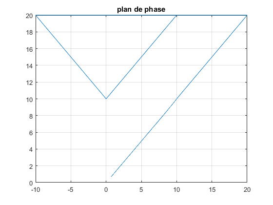

# switching-systems
Matlab code for master thesis

The phase plan of the system is represented by the picture below:

The step response of the system is represented with the switching low in the picture below

